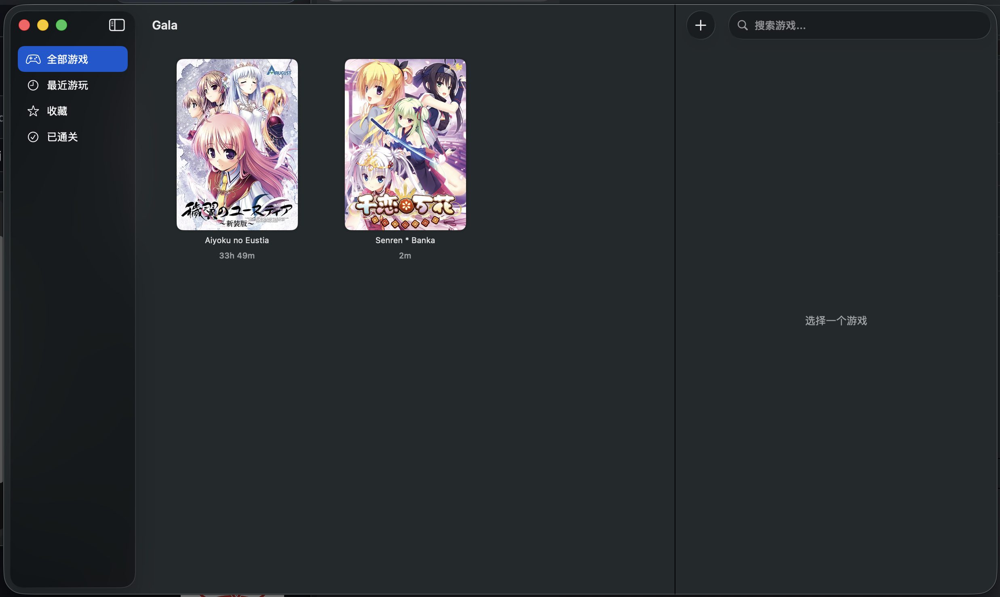
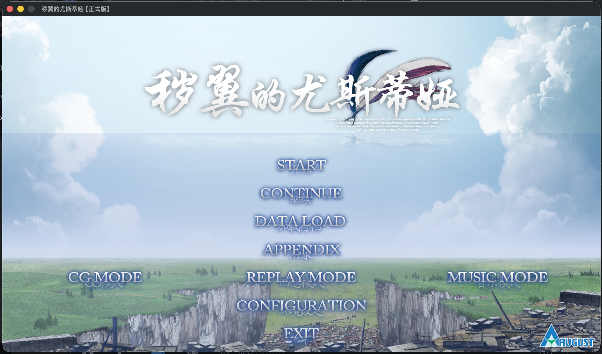

<p align="center">
  
</p>

<h1 align="center">Gala</h1>

<p align="center">
  macOS 原生 Galgame 启动器<br>
  添加游戏，配置环境，点击启动。Wine、字体、引擎适配全部自动完成。
</p>

---

> **开发动机**：这个项目的起因是想在 Mac 上玩[秽翼のユースティア](https://vndb.org/v3770)。
>
> **测试声明**：目前只测试了少量游戏（秽翼のユースティア / BGI、WHITE ALBUM2 / Leaf、千恋万花 / KiriKiri），兼容性数据仍然有限。如果你测试了其他游戏，无论成功还是失败，都欢迎[提 Issue](https://github.com/NozomiX1/Gala/issues) 反馈。

## 测试情况与已知问题

测试环境：M1 Pro MacBook Pro

| 游戏 | 引擎 | 状态 |
|------|------|------|
| 秽翼のユースティア | BGI/Ethornell | 已完整通关；启动和 OP 播放正常；字体无法修改，少数场景切换时音频加载会卡住数秒 |
| WHITE ALBUM2 | Leaf/AQUAPLUS | 启动、字体、OP/视频播放正常 |
| 千恋万花 | KiriKiri | 体验良好，字体可修改，未发现明显问题 |

- Wine 运行时有一定 CPU 占用，在被动散热机型（MacBook Air 等）上的表现未知，欢迎反馈

## 功能

- **显式运行环境** — 添加游戏后按需配置 Wine 前缀、中日文 locale / codepage / 字体
- **引擎识别** — 自动检测 KiriKiri、BGI、Leaf/AQUAPLUS、Artemis、SiglusEngine 等 10+ 引擎，应用最佳 Wine 预设
- **VNDB 集成** — 搜索匹配游戏，自动拉取封面、简介、标签和评分
- **游戏库管理** — 网格视图，支持搜索、收藏、移除运行环境和从库中移除
- **游戏时间统计** — 自动记录游玩时长
- **原生引擎支持** — Ren'Py / RPG Maker / Unity 游戏无需 Wine，直接原生启动
- **非 ASCII 路径** — 中日文游戏目录通过 Wine 驱动器映射自动处理

## 截图





## 系统要求

- macOS 14 (Sonoma) 或更高版本
- Apple Silicon Mac (M1+)

## 安装

1. 下载 [Gala.dmg](https://github.com/NozomiX1/Gala/releases/latest)，打开后将 Gala 拖入 Applications
2. 前往访达 → 应用程序，双击 Gala 启动（首次需确认打开）
3. 首次启动会自动准备 Wine 运行时和 CJK 字体依赖

## 构建

```bash
open Gala.xcodeproj
# Xcode → Build & Run
```

## 依赖

Gala 会自动下载并管理这些运行时依赖：

| 依赖 | 版本 | 用途 | 许可证 |
|------|------|------|--------|
| [Wine Staging](https://github.com/Gcenx/macOS_Wine_builds) | 11.6 (Gcenx) | 运行 Windows exe | LGPL |
| [思源黑体](https://github.com/adobe-fonts/source-han-sans) | Regular | Wine CJK 字体渲染 | OFL 1.1 |

部分旧式引擎的 OP/视频播放需要 DirectShow / LAV 组件。Gala 会在创建 bottle 时通过 [winetricks](https://github.com/Winetricks/winetricks) 自动安装这些组件，并自动准备 `cabextract`；用户通常不需要手动操作。如果系统未安装 `winetricks`，相关视频组件会被跳过，游戏本体仍可能启动，但 OP/视频可能无法播放。

## 工作原理

Gala 封装 Wine Staging 运行 Windows 视觉小说。Wine 游戏会按运行环境 profile 共享 Wine 前缀（bottle），避免每个游戏都复制一套完整环境。配置完全相同的引擎会落到同一个 profile，例如 BGI、Artemis、NScripter、YU-RIS、RealLive 会共享 `legacy-video`。如果某个引擎后续出现兼容性问题，可以将它拆到独立 profile。每个 bottle 会根据默认中文环境配置 codepage 和字体映射：

- **中文游戏** — GBK (936)
- **日文游戏** — Shift-JIS (932)

每个 Wine bottle 都会安装 Source Han Sans SC Regular，并将常见 Windows CJK / 旧式 UI 字体映射到它，避免中文、日文菜单和系统对话框显示为方框。

## 卸载与空间清理

macOS 不会在拖拽删除 `Gala.app` 时自动清理应用支持目录。Gala 下载的 Wine 运行时、bottle、字体和工具位于：

```bash
~/Library/Application Support/Gala
```

可以在 Gala 的「运行环境」页面清理 Wine 配置，或在卸载前清除所有 Gala 本地数据。如果已经卸载 Gala，也可以手动删除该目录来彻底释放空间。

## 架构

```
Gala/           SwiftUI 应用（Views, ViewModels）
GalaKit/        Swift Package — Wine 管理、引擎检测、VNDB 客户端
```

## 兼容性说明

Gala 自身的启动路径开销很小，主要成本来自 Wine 和游戏引擎本身。早期测试中，秽翼のユースティア（BGI）曾出现启动后长时间黑屏、OP 被跳过的问题；后续排查确认，原因是旧式 DirectShow / LAV 视频链路没有正确配置，而不是单纯的引擎初始化慢。

当前旧式视频预设会自动安装 `quartz`、`amstream`、`lavfilters`，覆盖 BGI、KiriKiri、SiglusEngine、Artemis、NScripter、YU-RIS、RealLive 等依赖旧式视频播放链路的引擎。Leaf/AQUAPLUS 额外使用更严格的 DirectShow / LAV RGB 输出配置，以修复 WHITE ALBUM2 的 OP/视频播放问题。

### 排除的方案

**魔改 Wine（fork/recompile）**：编译一次 60-75 分钟，Wine Staging 补丁每两周需要 rebase，维护成本相当于全职工作。参考 Proton-GE（个人维护者）和 CrossOver（整个公司 + Valve 资助）。

**原生引擎移植**：
- krkrsdl2（KiriKiri）：无 XP3 解密、缺少商业插件，README 明确写「不支持商业游戏」
- openbgi（BGI）：仅能运行 1 个试玩版，仍需 DLL 注入真实 BGI.exe
- 所有主流引擎（Artemis、SiglusEngine）均闭源，无法移植

## 为什么不用 GPTK

[Game Porting Toolkit](https://developer.apple.com/game-porting-toolkit/) 的 Wine 基础是 7.7（来自 CrossOver 22.1.1），其 32on64 WoW64 翻译层对日系 VN 引擎有根本性问题：

| 引擎 | 现象 | 根因 |
|------|------|------|
| BGI | 进程运行但窗口永远不出现 | 32on64 层无法处理 BGI 的窗口创建 |
| KiriKiri | 启动时崩溃（virtual.c 断言失败） | 虚拟内存管理器无法处理 KiriKiri 的内存分配模式 |

所有 GPTK 版本（1.0–3.0）使用相同的 Wine 7.7 基础，D3DMetal 版本号的升级不影响 Wine 层。几乎所有商业日系 galgame 都是 32-bit PE32 可执行文件，因此 **Wine Staging 11.6（Gcenx 构建）是目前唯一可行的方案**。

## 日系 Galgame 引擎现状

| 引擎 | 市场份额 | 趋势 | 原生移植 |
|------|----------|------|----------|
| KiriKiri Z | ~30%（~6800 作品） | 稳定，最大 | krkrsdl2 存在但无法运行商业游戏 |
| BGI/Ethornell | ~10-15% | 衰退，无新作 | openbgi 不可用 |
| Artemis | ~5-10% | 快速增长，业界迁移目标 | 闭源，不可能 |
| SiglusEngine | ~3-5% | 稳定（VisualArts 专用） | 无重实现 |
| CatSystem2 | ~3-5% | 缩小 | FelineSystem2 早期阶段 |

值得关注：Artemis 引擎支持 Win/Switch/PS4/PS5/iOS/Android/WebAssembly，若未来推出 64-bit Windows exe，GPTK 路径将重新可行。

## 许可证

MIT
